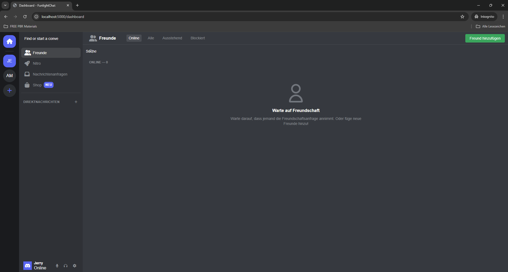
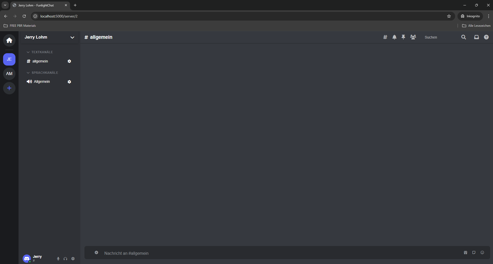

# Discord-Clone

A modern chat and communication platform inspired by Discord, built with Python Flask and modern web technologies. 


# ⚠️ Work in Progress
This project is under active development and not production-ready yet. (Project in German)

## Screenshots




## Features

### Core Functionality
- Real-time messaging with text formatting
- Server creation and management
- Channel organization with categories
- User status updates (online/offline)
- Friend system with friend requests
- User roles and permissions
- Beautiful, responsive UI

### Server Features
- Create custom servers with icons
- Multiple server templates (Gaming, Study, School, Custom)
- Text and voice channels
- Channel categories
- Server member management
- Server settings and customization

### Chat Features
- Real-time messaging
- Message history
- Text formatting support
- User presence indicators
- Typing indicators
- File attachments

### User System
- User registration and authentication
- Profile customization
- Friend management
- Online status tracking
- Server membership management

## Technology Stack

### Backend
- Python Flask for server-side logic
- SQLAlchemy for database management
- Flask-SocketIO for real-time communication
- Flask-Login for user authentication
- SQLite database

### Frontend
- HTML5, CSS3, JavaScript
- Custom responsive UI
- WebSocket for real-time updates
- Bootstrap for modals and components
- Font Awesome for icons

## Installation

1. Clone the repository:
   ```bash
   git clone https://github.com/FunlightStudios/Discord-Clone
   cd funlight
   ```

2. Create a virtual environment:
   ```bash
   python -m venv venv
   ```

3. Activate the virtual environment:
   - Windows:
     ```bash
     venv\Scripts\activate
     ```
   - Unix/MacOS:
     ```bash
     source venv/bin/activate
     ```

4. Install dependencies:
   ```bash
   pip install -r requirements.txt
   ```

5. Initialize the database:
   ```bash
   python
   >>> from funlight import create_app, db
   >>> app = create_app()
   >>> with app.app_context():
   ...     db.create_all()
   ```

6. Run the application:
   ```bash
   python run.py
   ```

7. Access the application at `http://localhost:5000`

## Development

### Project Structure
```
funlight/
├── funlight/
│   ├── __init__.py
│   ├── models.py
│   ├── auth.py
│   ├── main.py
│   ├── static/
│   │   ├── css/
│   │   ├── js/
│   │   └── images/
│   └── templates/
├── instance/
├── venv/
├── requirements.txt
├── run.py
└── README.md
```

### Key Components
- `models.py`: Database models for Users, Servers, Channels, Messages
- `auth.py`: Authentication routes and logic
- `main.py`: Main application routes and WebSocket events
- `static/js/server.js`: Client-side server management
- `static/js/chat.js`: Real-time chat functionality

## Contributing

1. Fork the repository
2. Create a feature branch
3. Commit your changes
4. Push to the branch
5. Create a Pull Request

## License

This project is licensed under the MIT License - see the LICENSE file for details.
